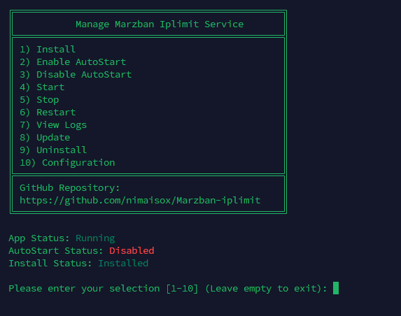

# **Marzban-iplimit**

**A tool to limit the number of active users with IPs for [Marzban](https://github.com/Gozargah/Marzban)**  
Supports both IPv4 and IPv6 for Marzban-node.  
*(Tested on Ubuntu 22.04 & 24.04)*  

---

## **Table of Contents**

1. [Installation](#installation)  
2. [Telegram Bot Commands](#telegram-bot-commands)  
3. [Common Issues and Solutions](#common-issues-and-solutions)  
4. [Building the Project](#building-the-project)  
5. [Running Without Building](#running-without-building)  
6. [Credits](#credits)

---

## **Installation**

To install Marzban iplimit, run the following command in your terminal:

```bash
sudo bash -c "$(curl -sL https://raw.githubusercontent.com/nimaisox/Marzban-iplimit/master/marzban_iplimit.sh)"
```

After installation, select option 10 to configure the settings. Enter the admin ID, domain, and bot token.
Ensure the entered values are correct.
Finally, start the application



Once the setup is complete, the script will display installation logs.

---

## **Telegram Bot Commands**

Marzban-iplimit integrates with a Telegram bot for easy management. Here are the available commands:

- `/start` – Start the bot.  
- `/setup` – Configure panel information (username, password, domain).  
- `/add_special_limit` – Add a specific IP limit for a user (e.g., limit to 5 IPs).  
- `/remove_special_limit` – Remove a specific IP limit for a user.  
- `/show_special_limit` – Show the list of users with special IP limits.  
- `/add_except_user` – Add a user to the exception list.  
- `/remove_except_user` – Remove a user from the exception list.  
- `/show_except_users` – Show the list of exception users.  
- `/add_admin` – Grant admin access to another chat ID.  
- `/remove_admin` – Revoke admin access from a user.  
- `/show_admins` – List all bot admins.  
- `/country_code` – Set the allowed country for IPs to improve accuracy.  
- `/set_general_limit_number` – Set the default IP limit for users not in the special limit list.  
- `/set_check_interval` – Define the interval for IP usage checks.  
- `/set_time_to_active_users` – Set the duration for considering active users.  
- `/backup` – Receive a `.zip` file containing `config.json` and `.disable_users.json`.

---

## **Common Issues and Solutions**

### 1. **Connections Persist After Disabling Users**
   - **Why does this happen?**  
     This issue is related to the Xray core, which maintains active connections until the user manually closes them. You may need to wait until these connections are closed.

---

### 2. **Restarting After Modifying `config.json`**
   - **Do I need to restart the program after editing the JSON file?**  
     No, Marzban-iplimit automatically adapts to changes in the JSON configuration file.

---

### 3. **IP Detection in Tunnel**
   - **How can I improve IP detection?**  
     The script must be installed on the same server where the tunneling is configured.

---

### 4. **Logs Missing While Using HAProxy**
   - **What should I do if logs are not available?**  
     Add the following line to your HAProxy config file:  
     ```
     option forwardfor
     ```
     Then restart your HAProxy service.

---

### 5. **Logs Missing Without Tunnel or HAProxy**
   - **What should I do if logs are still unavailable?**  
     Add this section to your Xray config file (if it doesn’t exist):  
     ```json
     "log": {
         "loglevel": "info"
     }
     ```

---

### 6. **Active Users Count Returns 0**
   - **Why does the active users count return 0?**  
     This issue is related to the Xray core. Restart the Xray core through the Marzban panel to resolve it.

If you still face issues, feel free to [open an issue](https://github.com/nimaisox/Marzban-iplimit/issues).

---

## **Building the Project**

### Pre-built Versions
Pre-built versions for Windows and Linux (amd64 and arm64) are available on the [releases page](https://github.com/nimaisox/Marzban-iplimit/releases).

- **Windows (amd64)** and **Linux (amd64)** builds are created using GitHub Actions.  
- **Linux (arm64)** builds are created locally, as GitHub does not currently provide ARM build machines.

---

### Building Locally

To build the project locally, first install the build essentials:

```bash
sudo apt install build-essential
```

Next, install the necessary dependencies:

```bash
pip install -r requirements.txt
```

Finally, build the project using [Nuitka](https://nuitka.net):

```bash
python3 -m nuitka --standalone --onefile --follow-imports \
    --include-plugin-directory=utils --include-package=websockets,logging \
    --python-flag="-OO" main.py
```

---

## **Running Without Building**

You can also run the program without building it. Simply install the dependencies and execute the script:

```bash
git clone https://github.com/nimaisox/Marzban-iplimit.git
cd Marzban-iplimit
pip install -r requirements.txt
python3 main.py
```

---

## **Credits**

This project is based on the original work by [Houshmand](https://github.com/houshmand-2005).
